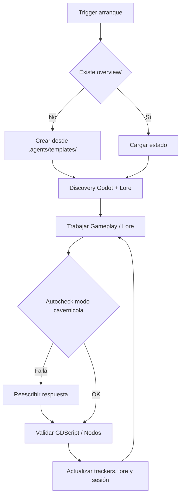

# Core Brain (Godot Game Dev & Lore Engine)

## Ciclo

## Triggers de arranque

Las siguientes señales disparan el protocolo completo de bootstrap (discovery + crear `overview/` y `overview/lore/` si faltan + mapear archivos de juego y narrativa):

- Frase **"ejecuta .agents"** → dispara el Protocolo de Auditoría de Learning (ver abajo).
- Inicio de sesión en cualquier juego o proyecto de lore con `.agents/` presente.
- Mensaje del usuario que mencione "nuevo juego", "nuevo lore", "inicializar godot", "bootstrap" o similar.
- Ausencia de `overview/session.md` al comenzar cualquier tarea de código o narrativa.
- Primer mensaje de una conversación cuando el proyecto tiene `.agents/` pero no tiene `overview/`.
- **Mensaje que comienza con `$`** → reconocer como $-comando y ejecutar protocolo definido en `core/commands.md` sin bootstrap completo previo.

## Protocolo "ejecuta .agents"

Cuando el usuario escribe **"ejecuta .agents"** (o variante como "corre .agents", "bootstrap .agents"):

1. **Leer el core completo**: `path_map.md`, `communication.md`, `brain.md`, `commands.md` y `AGENTS.md`.
<<<<<<< HEAD
2. **Auditar `overview/learning.md`**: por cada bullet en `## 📌 Propuestas de mejora`, aplicar el **Filtro Agnóstico (Escudo Anti-parches)**:
   - ❌ **RECHAZAR**: Snippets de GDScript específicos, propiedades/nodos concretos de una escena o comandos CLI rígidos.
   - ✅ **PERMITIR**: Únicamente procesos de diagnóstico agnósticos, reglas de gobernanza de agente, patrones de arquitectura de juego neutrales o metodologías de mapeo de lore.
3. **Promover las cumplidas**: mover cada propuesta verificada como implementada → al final de `## 📜 Histórico de mejoras aplicadas` con formato `- [YYYY-MM-DD] Descripción breve`.
4. **Conservar las pendientes**: dejar sin modificar los bullets que aún no están implementados en el core.
5. **Continuar con el flujo normal del core**: Inicio → Discovery → verificar `overview/` → trabajar.

## Inicio

- Leer core y `overview/session.md`, `overview/work.md`, `overview/trackers/progress.md`.
- Si falta `overview/` o archivos base, crearlos desde `.agents/templates/`.
- Si falta `overview/architecture.md`, crearlo desde la plantilla de arquitectura Godot.
- Si falta la carpeta `docs/lore/` o sus documentos narrativos (`narrative_tree.md`, `worldbuilding.md`, `characters.md`, `quests.md`), crearlos o copiarlos desde `.agents/templates/lore/` hacia `docs/lore/`.
- **Separación de responsabilidades**: `overview/` es exclusivo para control interno del agente. Documentación y lore del proyecto viven en `docs/`.
- **Alias divergentes**: si coexisten pares alias/canónico (`tasks.md`/`work.md`, `tracker.md`/`architecture.md`, `memory_session.md`/`session.md`) con contenido distinto → flag `[consolidar alias]` en `work.md`; no asumir cuál manda sin diff.
- **Auditoría de líneas GDScript**: listar scripts `.gd` >250L; sugerir IDs `deuda` en `work.md`.
- **Registro preventivo previo a ejecución (Pre-execution Work Logging)**: Al recibir un requerimiento, bug o adición de lore, actualizar `overview/work.md` y `overview/session.md` INMEDIATAMENTE antes de ejecutar cualquier acción. En caso de reporte de bug de juego, incluir hipótesis breve de causa raíz (5-7 palabras).
- **Backlog canónico**: solo `work.md` concentra IDs (con tags `[gameplay]`, `[lore]`, `[ui]`, `[audio]`, `[bug]`).
- **Historial de Intentos firmado por Agente**: En `work.md` y trackers de bugs/tareas, mantener un registro incremental de intentos de resolución.
=======
2. **Auditar y comparar `overview/learning.md` contra `.agents/core/` (Evaluación de 3 Vías)**:
   Por cada bullet en `## 📌 Propuestas de mejora`, evaluar si la propuesta fue:
   - ✅ **Aplicada**: Ya está implementada o integrada en la gobernanza/core actual → promover al final de `## 📜 Histórico de mejoras aplicadas` con formato `- [YYYY-MM-DD] Descripción breve` y eliminar el bullet activo.
   - ❌ **Rechazada**: Viola el **Filtro Agnóstico (Escudo Anti-parches)** (contiene código fuente específico, propiedades UI o comandos CLI rígidos) o es inviable → eliminar o registrar motivo de rechazo.
   - ⚠️ **En Conflicto**: Entra en conflicto directo con una regla existente en `.agents/core/` → marcar con el flag `[conflicto learning: regla X]` en `work.md` para aclaración del usuario.
   - ⏳ **Pendiente**: Cumple el filtro agnóstico y no está aplicada ni en conflicto → conservar en `## 📌 Propuestas de mejora`.
3. **Continuar con el flujo normal del core**: Inicio → Discovery → verificar `overview/` → trabajar.

## Inicio

- Ejecutar `git submodule status`.
- Leer core y `overview/session.md`, `overview/work.md`, `overview/work/tasks.md`, `overview/work/deuda_tecnica.md`, `overview/work/pendientes.md`, `overview/trackers/progress.md`.
- Si falta `overview/` o archivos base, crearlos desde `.agents/templates/`.
- Si falta `overview/architecture.md`, crearlo desde plantilla antes de trabajar.
- **Orden de prioridad de atención en `$work`**: 
  1. `overview/work/tasks.md` (tarea activa en ejecución)
  2. `overview/work/pendientes.md` (ítems de seguimiento identificados)
  3. `overview/work/deuda_tecnica.md` (deuda ordenada por prioridad **Alta**, **Media** y **Baja**)
- **Histórico de completados**: Tareas, pendientes y deudas resueltas se agregan/mueven a `## ✅ Completados (Historial)` conservando su ID correspondiente (`[w1]`, `[d2]`, `[p1]`).
- **Alias divergentes en bootstrap**: si coexisten pares alias/canónico (`tasks.md`/`work.md`, `tracker.md`/`trackers/architecture.md`, `memory_session.md`/`session.md`) con contenido distinto → flag obligatorio `[consolidar alias]` en `work.md`; **nunca** asumir cuál manda sin verificar diff previo.
- **`session.md` legado vs plantilla**: si faltan campos o encabezados requeridos (`Agente:`, `## Reanudar`, `## Cambios`) → reportar en boot `session legado` sin forzar migración automática implícita.
- **Auditoría de líneas (discovery/`$boot`)**: listar archivos de código fuente >250L; sugerir IDs `deuda` en `overview/work/deuda_tecnica.md` ordenadas por prioridad (**Alta**, **Media**, **Baja**); no crear filas fijas sin confirmación implícita de la tarea.
- **Registro preventivo previo a ejecución (Pre-execution Work Logging)**: Al recibir un requerimiento o bug, actualizar `overview/work.md`, `overview/work/tasks.md` y `overview/session.md` INMEDIATAMENTE antes de ejecutar cualquier acción. En `tasks.md`, describir la tarea a iniciar, clasificarla (`problema`, `mejora`, `refactor`) y proponer hipótesis/soluciones o rutas de trabajo. En caso de reporte de bug, incluir una hipótesis breve de causa raíz (5-7 palabras). Derivar automáticamente 1 o 2 mejoras/tareas asociadas a los pendientes para garantizar tolerancia a desconexión, corte de luz o agotamiento de tokens.
- **Backlog canónico único**: `overview/work.md` es el único índice maestro de IDs; los detalles de tareas activas van en `overview/work/tasks.md`, los pendientes identificados al cerrar en `overview/work/pendientes.md` y la deuda técnica en `overview/work/deuda_tecnica.md`. No duplicar en alias `tasks.md`.
- **Protocolo de Revisión de Trabajo (`work_review.md`)**: Al finalizar `$boot`, ejecutar obligatoriamente el protocolo definido en `templates/work_review.md` para auditar `overview/work/` y reportar un síntesis de 4 líneas.
- **Historial de Intentos firmado por Agente**: En `work.md` y trackers de bugs/tareas, mantener un registro incremental de intentos de resolución. Nunca borrar intentos previos. Reglas:
  - **Mismo día:** actualizar la entrada existente de esa fecha (sin duplicar).
  - **Diferente día:** crear nueva entrada con fecha + **firma del Agente** (modelo/versión) que ejecutó la prueba.
  - **Al resolver:** marcar estado como `hecho` indicando el Agente que logró la solución. Incluir nota concisa con (1) causa raíz exacta y (2) solución aplicada (código/configuración).
  - **Propósito:** ante problema similar futuro, consultar historial para reusar la solución exitosa o recomendar al agente que la resolvió.
>>>>>>> d55316b03e7586d1fbcfb117550721f2b8c07a17

### Discovery dinámico de Proyecto Godot & Lore

<<<<<<< HEAD
1. **Identificación de Engine**: Verificar presencia de `project.godot`. Si existe, reconocer como proyecto Godot 4.
2. **Estructura Estándar de Godot**:
   - `scenes/` o `res://scenes/` (Escenas `.tscn` de niveles, personajes, UI)
   - `scripts/` o `res://scripts/` (Lógica GDScript `.gd`)
   - `resources/` o `res://resources/` (Recursos personalizados `.tres` / datos de juego)
   - `autoload/` o `res://autoload/` (Singletons de estado global, EventBus, Audio, DialogueManager)
   - `assets/` (Sprites, modelos 3D, audio, fuentes)
3. **Mapeo de Documentación Viva y Lore (`docs/`)**:
   - Toda la documentación viva del proyecto, bibliografía del mundo, diseño y lore narrativo accesible para el usuario/equipo debe alojarse exclusivamente en `docs/` (ej. `docs/lore/`, `docs/gdd/`, `docs/architecture/`), manteniendo `overview/` estricto y exclusivo para el estado interno y plantillas de trabajo del agente (`session.md`, `work.md`, `trackers/`, etc.).
   - Estructura recomendada en `docs/lore/`: `narrative_tree.md`, `worldbuilding.md`, `characters.md`, `quests.md`, `dialogues.md`, `factions.md`.
4. **Protocolo de Inicialización de Proyectos Híbridos (Juego/Docs)**:
   - Al inicializar o bootstrapear proyectos sin código fuente inmediato (ej. Godot / Game Engine o proyectos puramente narrativos/técnicos), crear automáticamente la estructura raíz:
     - `game/` o `src/`: carpeta de código fuente.
     - `docs/`: carpeta de documentación de dominio, GDD y lore.
   - Garantizar que los documentos de diseño o lore se ubiquen en `docs/` y NUNCA se mezclen ni contaminen la taxonomía de trabajo interno en `overview/`.
5. **Lectura activa de contexto (`docs/` y `overview/context/`)**: Inspeccionar automáticamente los documentos de diseño y lore en `docs/` y notas suplementarias.
6. **Guardrail de tokens en discovery inicial:** leer máx 5 archivos de GDScript/escenas en el primer sweep; expandir solo cuando la tarea lo requiera explícitamente.
=======
1. Identificar framework del proyecto (Flutter → `pubspec.yaml`; Node → `package.json`; etc.).
2. Comparar carpetas raíz contra las carpetas estándar conocidas del framework (para Flutter, consultar `.agents/knowledge/flutter_structure.md`).
3. Inspección recursiva automática de toda carpeta no estándar: identificar de forma estricta las carpetas estándar del framework detectado y procesar automáticamente cualquier otro directorio raíz (incluyendo subcarpetas anidadas) mediante inspección semántica de contenido para su relocalización a `overview/` sin omitir ninguna por ser no-estándar.
4. Relocalización activa de metadatos: no ignorar archivos sin categoría; extraer y relocalizar documentación, notas de negocio o trackers hallados en subdirectorios no estándar a `overview/context/` o al tracker canónico correspondiente para cero archivos huérfanos.
5. **Lectura activa de contexto (`overview/context/`)**: El protocolo de inicio debe inspeccionar y leer automáticamente los archivos de contexto guardados en `overview/context/` (changelogs, tablas de datos, reglas de negocio) para recuperar el estado histórico y checkpoints del proyecto al reanudar.
6. **Auto-inicialización de trackers de contenido externo (`content_*.md`)**: Al detectar manejo o extracción de datos de dominio (ej. catálogo de datos / colecciones masivas), el bootstrap debe crear e inicializar automáticamente los trackers `content_gemini.md`, `content_claude.md`, `content_gpt.md` y `content_verified.md` desde `.agents/templates/trackers/`.
7. **Exploración progresiva del sistema**: La cartografía del proyecto debe desarrollarse de forma incremental y contextual, evitando una revisión exhaustiva de todo el código en una sola pasada. Las zonas nuevas del mapa se incorporan conforme el trabajo las requiere, preservando una visión clara del alcance real de la tarea sin sobreexplorar el repositorio. **Guardrail de tokens en discovery inicial:** leer máx 5 archivos de código fuente en el primer sweep; expandir solo cuando la tarea lo requiera explícitamente.
>>>>>>> d55316b03e7586d1fbcfb117550721f2b8c07a17

### Reglas de Arquitectura y Código GDScript 2.0

<<<<<<< HEAD
1. **Tipado Estático Obligatorio**: En GDScript, siempre usar tipos explícitos (`var health: int = 100`, `func take_damage(amount: int) -> void:`).
2. **Patrón "Call Down, Signal Up"**:
   - Nodos padre llaman funciones públicas de nodos hijo.
   - Nodos hijo emiten `signal` hacia arriba (nunca asumen estructura del padre).
3. **EventBus Centralizado**: Usar Autoload para señales globales compartidas entre sistemas desacoplados (ej. `EventBus.player_died.emit()`).
4. **Diseño Orientado a Recursos (`.tres`)**: Separar los datos (Stats, Items, DialogueNodes, QuestData) en `Resource` GDScript reutilizables para facilitar la carga desde el mapa de lore.
5. **Máquinas de Estado Finitas (FSM)**: Para el control de personajes y estados del juego (Idle, Run, Attack, Dialogue, Pause), aislar la lógica en nodos o estados reutilizables.
6. **Límite de Líneas**: Scripts `.gd` idealmente <250 líneas; máximo 300 líneas. Refactorizar componentes grandes en sub-nodos o recursos.
=======
Reconocer automáticamente sin listas rígidas: `i18n`, `l10n`, `auth`, `routes`, `api`, `dto`, `repo`, `vm`, `bloc`, `di`, `ioc`, `ci`, `cd`, `qa`, `ux`, `sdk`, `orm`, `rbac`, `jwt`, `ssr`, `csr`. Si aparece un acrónimo desconocido → buscar en contexto del proyecto antes de preguntar.

### Clasificación semántica por contenido

Al encontrar cualquier carpeta o archivo no mapeado al framework, inspeccionar su contenido interno independientemente del nombre de la carpeta:

| Señales en contenido | Clasificar como |
|---|---|
| Fechas, `## Sesión`, `## Objetivo` | `overview/history/` |
| `- [ ]`, `- [x]`, progreso, estado | `overview/trackers/` |
| Resúmenes ejecutivos, arquitectura | `overview/architecture.md` |
| Contexto de negocio, datos de dominio | `overview/context/` |
| Flujos de dominio (pasos agnósticos: origen→procesamiento→destino) | `overview/workflows/` |
| Mejoras al core, candidatos | `overview/learning.md` |

### Normalización de rutas

- Todas las rutas de `overview/` siempre en minúsculas: `overview/`, `overview/trackers/`, `overview/history/`, `overview/context/`, `overview/workflows/`, `overview/work/`.
- Si existe colisión (`Overview/` vs `overview/`): mapear alias, usar ruta lowercase como canónica.
- En Linux/Mac (case-sensitive): verificar con `ls` antes de asumir que no existe.

### Política de relocalización activa y no ignorar

Ningún archivo de documentación, notas de negocio o tracker hallado en subdirectorios no estándar puede ignorarse silenciosamente o quedar huérfano. Opciones:

1. Mapeado a categoría conocida → relocalizar/consolidar en `overview/`, `overview/trackers/` u `overview/history/`.
2. Contexto de dominio o metadatos sueltos → extraer y relocalizar activamente a `overview/context/`.
3. Ambiguo → referenciar en `overview/work.md` con nota `[pendiente clasificar]`.
>>>>>>> d55316b03e7586d1fbcfb117550721f2b8c07a17

## Handoff de Agente

Cuando el Agente que retoma una sesión es distinto al que la inició (diferente modelo o proveedor):

1. **Identificar cambio**: comparar `Agente:` en `overview/session.md` con el modelo actual. Si difieren → activar protocolo de handoff.
<<<<<<< HEAD
2. **Validar estado previo**: leer `## Reanudar` de `session.md` y verificar que el `Contexto crítico` es coherente con el estado actual de las escenas/scripts o documentos de lore.
3. **No asumir correctitud**: inspeccionar el último cambio registrado en `## Cambios` y confirmar su compilación/validez en Godot o coherencia narrativa.
4. **Registrar handoff**: actualizar `session.md` con firma propia y bullet de handoff.

## Cierre

- Ejecutar validación de GDScript o verificación de sintaxis de escenas cuando aplique.
- Actualizar trackers, mapas de lore (`docs/lore/`), estado de arquitectura Godot (`overview/architecture.md`) y trabajo (`overview/work.md`).
- Registrar causa raíz y solución firmada para cualquier bug resuelto.
- Proponer aprendizajes candidatos al core mediante **Filtro Agnóstico**.
=======
2. **Validar estado previo**: leer `## Reanudar` de `session.md` y verificar que el `Contexto crítico` es coherente con el estado actual de los archivos mencionados. Si hay inconsistencia, anotar en `work.md` antes de continuar.
3. **No asumir correctitud**: el Agente entrante no da por válido el trabajo del anterior sin verificación. Inspeccionar el último cambio registrado en `## Cambios` y confirmar que el archivo/función afectado existe y compila.
4. **Registrar handoff**: al comenzar a trabajar, actualizar `session.md`:
   - `Agente que reanuda:` con la firma propia (formato `core/communication.md §3`).
   - Añadir bullet en `## Cambios`: `- Handoff de [Agente anterior] → [Agente actual].`
5. **Historial de intentos**: si hay bugs abiertos en `work.md`, revisar el historial de intentos antes de proponer solución — el agente anterior puede haber intentado el mismo enfoque.

> Propósito: evitar trabajo duplicado, detectar inconsistencias de estado y aprovechar el historial firmado para elegir el enfoque más efectivo.

## Arquitectura viva y Mapeo Incremental por Tarea

- **Arquitectura viva en `overview/architecture.md`**: El proyecto debe mantener un mapa operativo actualizado por sesión.
- **Mapeo incremental de arquitectura por `$work`**: Al registrar o iniciar una tarea, el agente debe actualizar `overview/architecture.md` **únicamente con los nodos (pantallas, clases, providers, repos)** que esa tarea concretamente va a tocar o modificar. Queda prohibido hacer un sweep exhaustivo de todo el repositorio para rehacer el mapa entero. Objetivo: mantener el mapa vivo a costo de tokens mínimo.
- **Modularización de Trackers por Subcarpetas / Archivo Individual**: Para colecciones masivas de datos, los trackers de contenido deben modularizarse en directorios (`overview/trackers/content/<categoria>/<item>.md`) y el contenido verificado mapearse directamente a la estructura final en app.

## Cierre

- Ejecutar `flutter analyze` cuando aplique.
- **Suite de tests (sin carpeta `test/`)**: Si el proyecto **no posee** carpeta o suite de pruebas (`test/`) → el estado de validación de pruebas es `no aplica` (no representa una deuda técnica). Si la suite de tests **sí existe** pero no fue ejecutada o falló → estado `no verificado` + motivo explícito. Evitar marcar un fallo de ejecución del CLI por suite ausente como una deuda falsa.
- **Pendientes de sesión**: registrar cualquier ítem o tarea secundaria identificada durante la ejecución en `overview/work/pendientes.md` para su seguimiento en sesiones posteriores.
- Actualizar tracker correspondiente, sesión e índice maestro `overview/work.md`. Si se resolvió un bug/tarea con historial de intentos, registrar firma del Agente resolvedor, causa raíz y solución en la entrada correspondiente. Trasladar ítems resueltos a `## ✅ Completados (Historial)` con su ID.
- Si validación falla o no puede ejecutarse (habiendo suite): marcar `no verificado`, indicar motivo; nunca presentar como validado.
- Archivar sesiones antiguas en `overview/history/` cuando dejen de ser útiles al contexto activo.
- Si hay mejora candidata al core: aplicar **Filtro Agnóstico** (prohibido sugerir código, propiedades de UI o comandos específicos; solo procesos de diagnóstico o gobernanza). Si pasa el filtro, agregar bullet a `overview/learning.md` (lista limpia, sin fechas/estados).
- Una vez promovida al repo oficial: mover al Histórico como una línea. Eliminar el bullet activo.

## Calidad y Resolución de Dependencias

- Cambios quirúrgicos. No mejorar código ajeno sin necesidad.
- Flutter: Firebase y manejo de estado dependen de cada proyecto.
- Archivos Dart idealmente <250 líneas; máximo 300.
- **Resolución de dependencias vs SDK del entorno**: Si `flutter pub get` / `pub` falla por restricciones de versión entre el SDK del package y el SDK instalado en el entorno, preferir el **upgrade del SDK global del entorno** cuando el proyecto requiere versiones modernas. El downgrade de packages debe considerarse únicamente como un parche temporal.

## Contenido externo

- Usar trackers separados: Gemini, Claude y GPT.
- `verificado` = 2+ agentes coinciden, fuentes compatibles y sin conflicto abierto.
- Registrar resultado breve, fuentes y fecha. Si hay conflicto, marcar `conflicto`.
>>>>>>> d55316b03e7586d1fbcfb117550721f2b8c07a17

