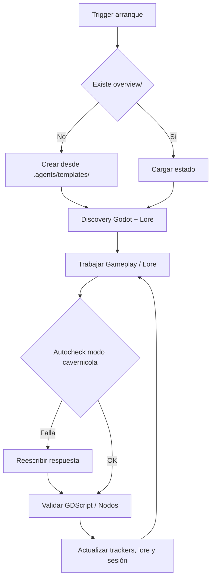

# Core Brain (Godot Game Dev & Lore Engine)

## Ciclo

## Triggers de arranque

Las siguientes señales disparan el protocolo completo de bootstrap (discovery + crear `overview/` y `overview/lore/` si faltan + mapear archivos de juego y narrativa):

- Frase **"ejecuta .agents"** → dispara el Protocolo de Auditoría de Learning (ver abajo).
- Inicio de sesión en cualquier juego o proyecto de lore con `.agents/` presente.
- Mensaje del usuario que mencione "nuevo juego", "nuevo lore", "inicializar godot", "bootstrap" o similar.
- Ausencia de `overview/session.md` al comenzar cualquier tarea de código o narrativa.
- Primer mensaje de una conversación cuando el proyecto tiene `.agents/` pero no tiene `overview/`.
- **Mensaje que comienza con `$`** → reconocer como $-comando y ejecutar protocolo definido en `core/commands.md` sin bootstrap completo previo.

## Protocolo "ejecuta .agents"

Cuando el usuario escribe **"ejecuta .agents"** (o variante como "corre .agents", "bootstrap .agents"):

1. **Leer el core completo**: `path_map.md`, `communication.md`, `brain.md`, `commands.md` y `AGENTS.md`.
2. **Auditar `overview/learning.md`**: por cada bullet en `## 📌 Propuestas de mejora`, aplicar el **Filtro Agnóstico (Escudo Anti-parches)**:
   - ❌ **RECHAZAR**: Snippets de GDScript específicos, propiedades/nodos concretos de una escena o comandos CLI rígidos.
   - ✅ **PERMITIR**: Únicamente procesos de diagnóstico agnósticos, reglas de gobernanza de agente, patrones de arquitectura de juego neutrales o metodologías de mapeo de lore.
3. **Promover las cumplidas**: mover cada propuesta verificada como implementada → al final de `## 📜 Histórico de mejoras aplicadas` con formato `- [YYYY-MM-DD] Descripción breve`.
4. **Conservar las pendientes**: dejar sin modificar los bullets que aún no están implementados en el core.
5. **Continuar con el flujo normal del core**: Inicio → Discovery → verificar `overview/` → trabajar.

## Inicio

- Leer core y `overview/session.md`, `overview/work.md`, `overview/trackers/progress.md`.
- Si falta `overview/` o archivos base, crearlos desde `.agents/templates/`.
- Si falta `overview/architecture.md`, crearlo desde la plantilla de arquitectura Godot.
- Si falta la carpeta `overview/lore/` o sus plantillas (`narrative_tree.md`, `worldbuilding.md`, `characters.md`, `quests.md`), crearlos desde `.agents/templates/lore/`.
- **Alias divergentes**: si coexisten pares alias/canónico (`tasks.md`/`work.md`, `tracker.md`/`architecture.md`, `memory_session.md`/`session.md`) con contenido distinto → flag `[consolidar alias]` en `work.md`; no asumir cuál manda sin diff.
- **Auditoría de líneas GDScript**: listar scripts `.gd` >250L; sugerir IDs `deuda` en `work.md`.
- **Registro preventivo previo a ejecución (Pre-execution Work Logging)**: Al recibir un requerimiento, bug o adición de lore, actualizar `overview/work.md` y `overview/session.md` INMEDIATAMENTE antes de ejecutar cualquier acción. En caso de reporte de bug de juego, incluir hipótesis breve de causa raíz (5-7 palabras).
- **Backlog canónico**: solo `work.md` concentra IDs (con tags `[gameplay]`, `[lore]`, `[ui]`, `[audio]`, `[bug]`).
- **Historial de Intentos firmado por Agente**: En `work.md` y trackers de bugs/tareas, mantener un registro incremental de intentos de resolución.

### Discovery dinámico de Proyecto Godot & Lore

1. **Identificación de Engine**: Verificar presencia de `project.godot`. Si existe, reconocer como proyecto Godot 4.
2. **Estructura Estándar de Godot**:
   - `scenes/` o `res://scenes/` (Escenas `.tscn` de niveles, personajes, UI)
   - `scripts/` o `res://scripts/` (Lógica GDScript `.gd`)
   - `resources/` o `res://resources/` (Recursos personalizados `.tres` / datos de juego)
   - `autoload/` o `res://autoload/` (Singletons de estado global, EventBus, Audio, DialogueManager)
   - `assets/` (Sprites, modelos 3D, audio, fuentes)
3. **Mapeo de Lore y Narrativa (`overview/lore/`)**:
   - **Arbol Narrativo (`narrative_tree.md`)**: Actos, Capítulos, Nodos de historia, Banderas/Flags globales (`game_story_flags`).
   - **Worldbuilding (`worldbuilding.md`)**: Historia antigua, Cosmología, Regiones, Sistemas de magia/tecnología, Facciones.
   - **Fichas de Personajes (`characters.md`)**: Protagonistas, NPCs, Antagonistas, motivación, arcos y estilos de diálogo.
   - **Misiones / Quests (`quests.md`)**: Misiones principales y secundarias, detonantes, objetivos, decisiones y recompensas.
   - **Árboles de Diálogo (`dialogues.md`)**: Estructura de conversación y sus conectores con recursos o complementos (Dialogue Manager/Dialogic).
4. **Lectura activa de contexto (`overview/context/`)**: Inspeccionar automáticamente documentos suplementarios de diseño de juego (Game Design Document - GDD, bibliografía de lore, referencias artísticas).
5. **Guardrail de tokens en discovery inicial:** leer máx 5 archivos de GDScript/escenas en el primer sweep; expandir solo cuando la tarea lo requiera explícitamente.

### Reglas de Arquitectura y Código GDScript 2.0

1. **Tipado Estático Obligatorio**: En GDScript, siempre usar tipos explícitos (`var health: int = 100`, `func take_damage(amount: int) -> void:`).
2. **Patrón "Call Down, Signal Up"**:
   - Nodos padre llaman funciones públicas de nodos hijo.
   - Nodos hijo emiten `signal` hacia arriba (nunca asumen estructura del padre).
3. **EventBus Centralizado**: Usar Autoload para señales globales compartidas entre sistemas desacoplados (ej. `EventBus.player_died.emit()`).
4. **Diseño Orientado a Recursos (`.tres`)**: Separar los datos (Stats, Items, DialogueNodes, QuestData) en `Resource` GDScript reutilizables para facilitar la carga desde el mapa de lore.
5. **Máquinas de Estado Finitas (FSM)**: Para el control de personajes y estados del juego (Idle, Run, Attack, Dialogue, Pause), aislar la lógica en nodos o estados reutilizables.
6. **Límite de Líneas**: Scripts `.gd` idealmente <250 líneas; máximo 300 líneas. Refactorizar componentes grandes en sub-nodos o recursos.

## Handoff de Agente

Cuando el Agente que retoma una sesión es distinto al que la inició (diferente modelo o proveedor):

1. **Identificar cambio**: comparar `Agente:` en `overview/session.md` con el modelo actual. Si difieren → activar protocolo de handoff.
2. **Validar estado previo**: leer `## Reanudar` de `session.md` y verificar que el `Contexto crítico` es coherente con el estado actual de las escenas/scripts o documentos de lore.
3. **No asumir correctitud**: inspeccionar el último cambio registrado en `## Cambios` y confirmar su compilación/validez en Godot o coherencia narrativa.
4. **Registrar handoff**: actualizar `session.md` con firma propia y bullet de handoff.

## Cierre

- Ejecutar validación de GDScript o verificación de sintaxis de escenas cuando aplique.
- Actualizar trackers, mapas de lore (`overview/lore/`), estado de arquitectura Godot (`overview/architecture.md`) y trabajo (`overview/work.md`).
- Registrar causa raíz y solución firmada para cualquier bug resuelto.
- Proponer aprendizajes candidatos al core mediante **Filtro Agnóstico**.

