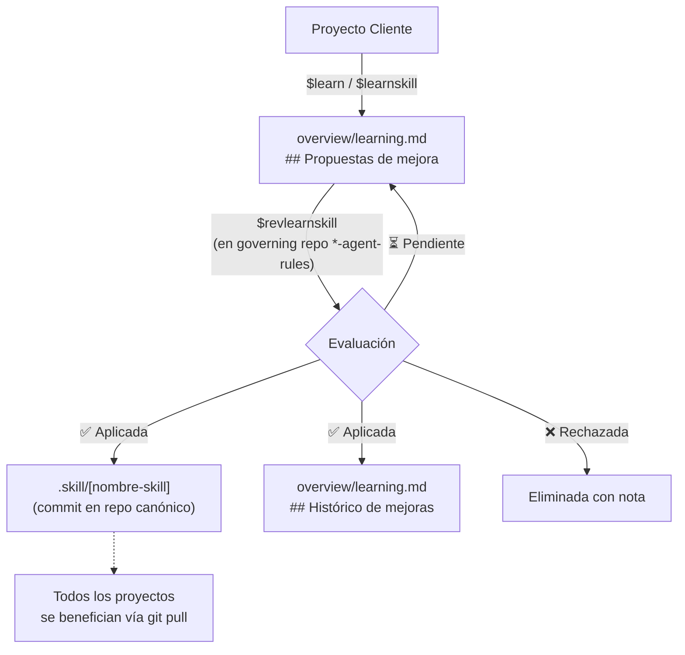

# 📋 Protocolo de Aprendizaje Inmutable

## 🔒 Principio de Inviolabilidad Absoluta

> **REGLA MÁXIMA DEL ECOSISTEMA — INVIOLABLE:**
> Ningún agente, script ni usuario cliente puede **jamás** modificar, editar, reemplazar o sobrescribir archivos dentro de `.agents/` ni `.skill/` directamente desde un **proyecto cliente**.
>
> - `.agents/` → Repositorio de gobernanza de solo lectura.
> - `.skill/` → Habilidades instaladas como submódulos Git de solo lectura.
>
> Todo cambio legítimo en `.agents/` o `.skill/` DEBE realizarse:
> 1. **En el repositorio oficial de gobernanza** (`*-agent-rules`) durante el ciclo `$revlearnskill`.
> 2. Mediante **Pull Request** o **commit directo en el repo canónico** de la skill o del governing repository.
> 3. **Jamás** mediante edición local en un proyecto cliente.

---

## ⚡ Comandos del Protocolo de Aprendizaje

### `$learn [texto]`
**Propósito**: Registrar un aprendizaje general candidato (agnóstico de skill) desde un proyecto cliente.

**Protocolo**:
1. Validar texto con el **Filtro Agnóstico** (`brain.md`): abstraer código, nombres de módulos específicos y rutas. Si contiene código, abstraer a principio de arquitectura.
2. Agregar bajo `## 📌 Propuestas de mejora` en `overview/learning.md`:
   ```
   - propuesta en términos agnósticos de arquitectura...
   ```
3. Si el archivo no existe, crearlo desde `templates/learning.md`.
4. **NUNCA** modificar `.agents/` ni `.skill/`. Solo registrar en `overview/`.
5. Confirmar: `Aprendizaje registrado en overview/learning.md.`

---

### `$learnskill [nombre-skill] [texto]`
**Propósito**: Registrar una propuesta de mejora específica a una **skill instalada** en `.skill/`, sin tocarla directamente.

**Protocolo**:
1. Identificar el nombre de la skill (ej: `i18n-agent-skill`, `monitoring-agent-skill`).
2. Agregar bajo `## 📌 Propuestas de mejora` en `overview/learning.md` usando la **convención de etiquetado**:
   ```
   - [nombre-skill] propuesta de mejora en términos descriptivos...
   ```
   Ejemplo:
   ```
   - [i18n-agent-skill] Agregar soporte para idioma PT-BR en la cascada de fallback.
   - [monitoring-agent-skill] El comando $monitor:audit no detecta módulos sin barrel export.
   ```
3. **NUNCA** modificar `.skill/[nombre-skill]/` directamente.
4. Confirmar: `Propuesta para [nombre-skill] registrada en overview/learning.md.`

---

### `$revlearnskill`
**Propósito**: Revisar y promover propuestas de aprendizaje de skills. **Solo se ejecuta en el repositorio oficial de gobernanza** (`*-agent-rules`) durante el ciclo `$boot` del Core.

**Protocolo** (en el repo canónico `*-agent-rules`):
1. Leer `overview/learning.md` (del proyecto bajo revisión o del historial acumulado en el governing repo).
2. Para cada bullet en `## 📌 Propuestas de mejora` con etiqueta `- [nombre-skill]`:
   - ✅ **Aplicada**: La mejora ya fue incorporada al repo canónico de la skill → mover a `## 📜 Histórico de mejoras aplicadas` con fecha y referencia.
   - ❌ **Rechazada**: Viola el Filtro Agnóstico o es demasiado específica del proyecto → eliminar con nota de razón.
   - ⏳ **Pendiente**: Válida pero aún no incorporada → conservar en `## 📌 Propuestas de mejora`.
3. Las propuestas aprobadas se incorporan al repo canónico de la skill mediante commit directo o PR.
4. Confirmar: `Revisión $revlearnskill completada. [N] aplicadas, [N] pendientes, [N] rechazadas.`

---

## 📁 Estructura Canónica de `overview/learning.md`

```markdown
# 📚 Learning & Propuestas de Mejora

## 📌 Propuestas de mejora

- aprendizaje general agnóstico...
- [i18n-agent-skill] propuesta específica de la skill i18n...
- [monitoring-agent-skill] propuesta específica de monitoring...

## 📜 Histórico de mejoras aplicadas

- [YYYY-MM-DD] [nombre-skill] descripción de lo que fue incorporado.
```

---

## 🔁 Ciclo de Vida Completo


