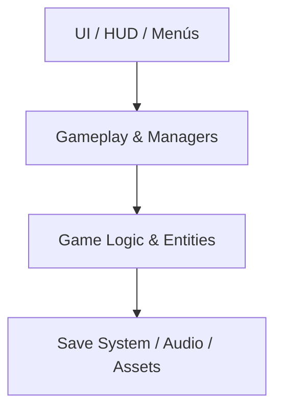

# Arquitectura Game Engine (Godot / Unity / Unreal)

Guía de referencia rápida para organizar la arquitectura de videojuegos por capas desacopladas.

```mermaid
graph TD
    UI[UI / HUD / Menús] --> Gameplay[Gameplay & Managers]
    Gameplay --> Core[Game Logic & Entities]
    Core --> Data[Save System / Audio / Assets]
```
