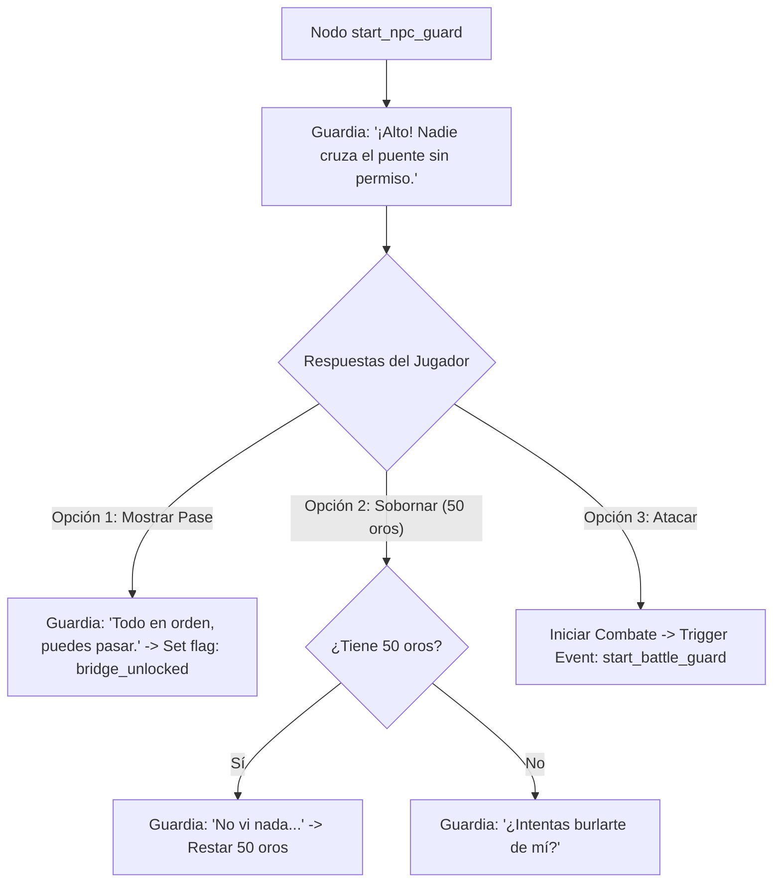

# Nodos de Diálogo y Conversaciones

Diseño de árboles de diálogo y eventos narrativos conectables con Godot (Dialogue Manager / Dialogic / Custom Resource).

## Estructura de Nodo de Diálogo

## Nodos de Diálogo Especificados

### Conversación: `dlg_npc_guard_bridge`
- **Locutor**: Guardia del Puente (`npc_guard_01`)
- **Condición de Entrada**: `flag: bridge_unlocked == false`

#### Nodo `start`:
- **Texto**: *"¡Alto! Nadie cruza las puertas del valle sin la autorización del Comandante."*
- **Opciones**:
  1. `[Mostrar documento]` (Requiere item: `item_pass_valley`) -> Saltar a `node_pass_accepted`
  2. `[Intimidar]` (Comprobación Fuerza >= 12) -> Saltar a `node_intimidate_success` / `node_intimidate_fail`
  3. *"Regresaré más tarde."* -> Cerrar diálogo.

#### Eventos de Salida (GDScript Signal Callbacks):
- `node_pass_accepted`: `EventBus.emit_signal("flag_changed", "bridge_unlocked", true)`
- `node_intimidate_fail`: `EventBus.emit_signal("start_combat", "npc_guard_01")`
