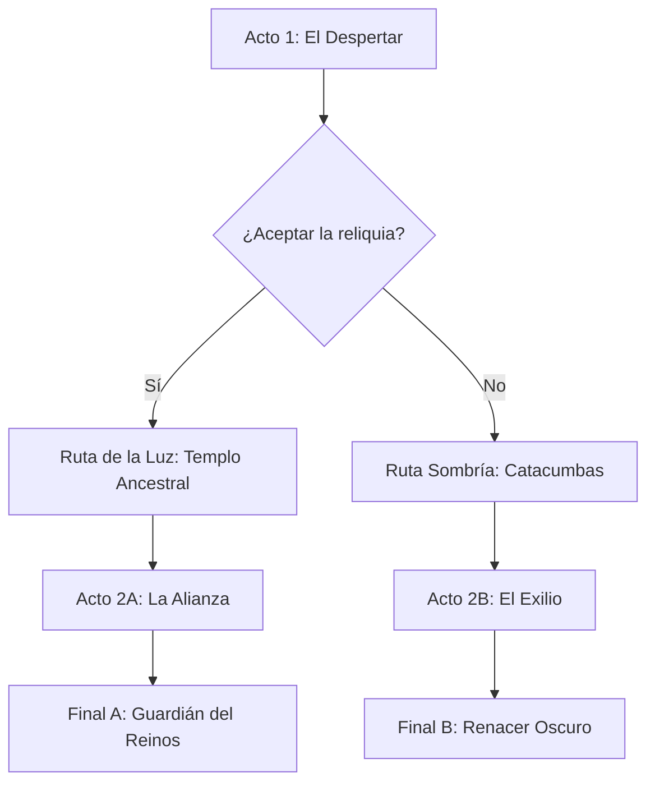

# Árbol Narrativo y Flujo de la Historia

Mapa de estructura dramática, actos, ramas de decisión y banderas de historia (`game_story_flags`).

## Estructura Dramática Generales

## Actos y Capítulos

### Acto 1: [Nombre del Acto 1]
- **Premisa Dramática**: [Breve resumen de la situación inicial y detonante]
- **Capítulo 1**: [Eventos principales y primer conflicto]
- **Punto de No Retorno**: [Decisión crítica que cierra el Acto 1]

### Acto 2: [Nombre del Acto 2]
- **Conflicto Principal**: [Desarrollo del problema y revelación de secretos]
- **Ramificación de decisiones**: [Explicación de las rutas A y B]

### Acto 3: [Nombre del Acto 3]
- **Clímax**: [Enfrentamiento o resolución del dilema central]
- **Resolución**: [Estado final del mundo y del protagonista]

## Banderas Narrativas de Estado (`game_story_flags`)

| ID de Banderas (`flag_id`) | Tipo | Valor Inicial | Descripción y Efecto en Gameplay |
|---|---|---|---|
| `act1_relic_accepted` | `bool` | `false` | `true` si el jugador acepta la reliquia en el capítulo 1 |
| `npc_guard_spared` | `bool` | `false` | Permite reclutar al guardia en el Acto 2 |
| `reputation_faction_rebels` | `int` | `0` | Puntos de alineamiento con los rebeldes (-100 a +100) |
